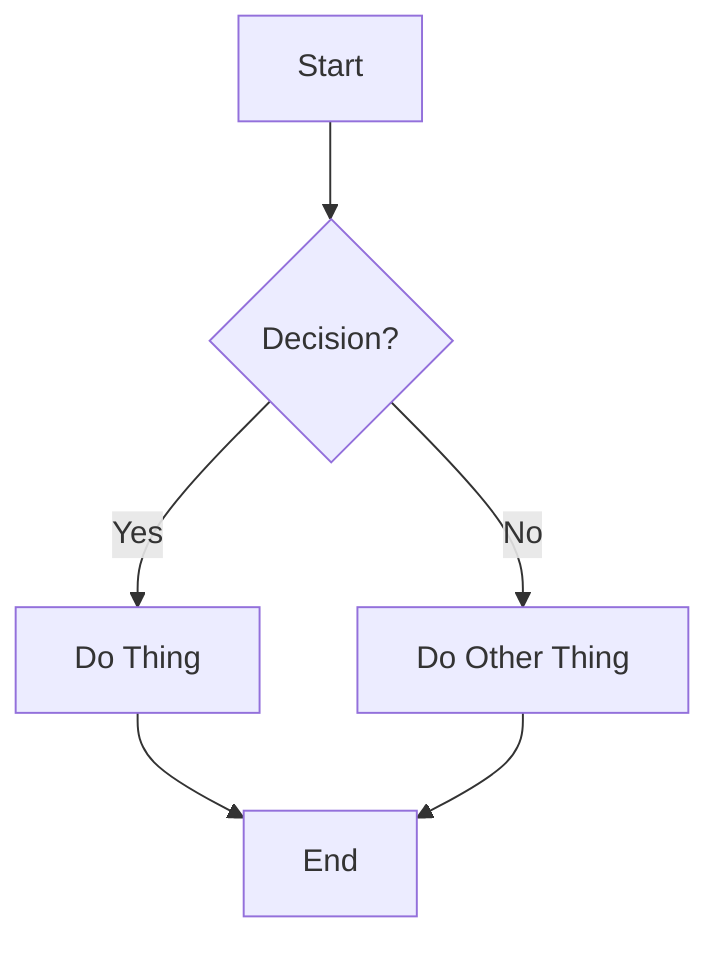
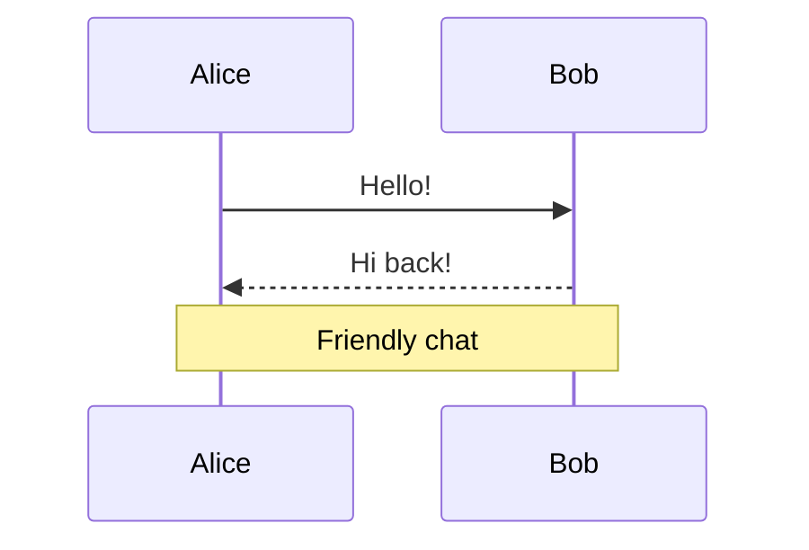

# Markdown Test File 3: The Ultimate Playground 🧪

Let’s push your previewer to the limit!

## Fancy Typography & Symbols

**Bold**, *italic*, ***both***, ~~strikethrough~~, <u>underline</u> (if supported), ==highlight==, and `monospace`.

Superscript: 2ⁿᵈ place  
Subscript: H₂SO₄

### Emojis Everywhere 😎
- 🔥 Fire
- 🌟 Sparkles
- 🐙 Octopus
- 🍕 Pizza
- 🎉 Party

## Math Equations (KaTeX/LaTeX – if your previewer supports it)

Inline math: The quadratic formula is $x = \frac{-b \pm \sqrt{b^2 - 4ac}}{2a}$.

Display math:
$$
E = mc^2
$$

$$
\int_{-\infty}^{\infty} e^{-x^2} \, dx = \sqrt{\pi}
$$

## Mermaid Diagrams (Flowcharts, Sequences, etc.)

## Callouts / Admonitions (if supported)

> [!note]
> This is a gentle note.

> [!tip]
> Pro tip: Use Markdown previews daily!

> [!warning]
> Careful – this is important.

> [!danger]
> Danger zone ahead!

## Footnotes

Here’s a statement with a footnote[^1].

And another one[^2].

[^1]: This is the first footnote – pretty cool, right?
[^2]: Footnotes are great for extra context without cluttering the main text.

## Details / Spoiler (Collapsible Sections)

Click to reveal a secret

The secret is... you’re awesome for testing Markdown! 🎊

## Table with Emojis and Alignment

| Task              | Status   | Priority | Notes                  |
|-------------------|:--------:|---------:|------------------------|
| Write Markdown    | ✅       | High     | Done!                  |
| Add diagrams      | ✅       | Medium   | Mermaid rocks          |
| Test preview      | 🔄       | High     | In progress            |
| Celebrate         | ⏳       | Low      | Soon™                  |

## Final Thoughts

This file has **everything**:
- Math
- Diagrams
- Callouts
- Footnotes
- Collapsibles
- Tables
- Emojis

If your previewer handles most of this, you’ve got a winner! 🏆
